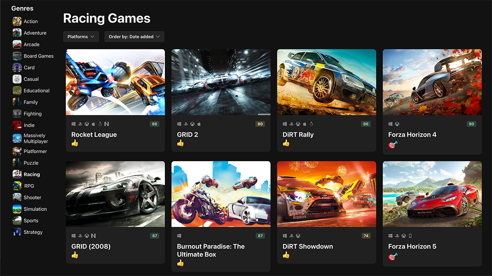
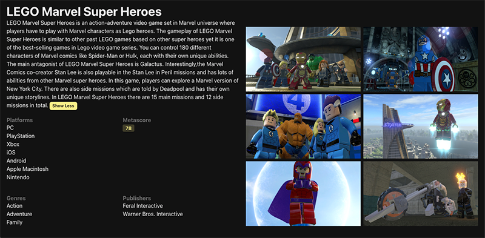

# Game Hub

GameHub is a video game discovery web app that helps you find new and interesting games to play. With GameHub, you can search for games by platform, genre, and more.

Game Hub is a platform designed to streamline your gaming experience by providing easy sorting options based on genres and release dates, as well as a powerful search feature to find your favorite games in no time! This project is a simplified replica of the [RAWG's site](https://rawg.io/), which uses the non-commercial access of their [API](https://rawg.io/apidocs) and is based on the Mosh Hamedani's course [React 18 and TypeScript](https://codewithmosh.com/p/ultimate-react-part1).

## Features

- Platform & genre filters to easily find games that match your preferences.
- Game info includes summary, platform, genre, publisher, and metascore ratings.
- Dark/Light mode switch.

## Tech Stuff

- React / TypeScript
- Vite build tool for fast development and optimized production builds.
- Responsive Design, ensuring an optimal experience on various devices.
- Axios to fetch and submit data via REST APIs.
- React Hook Forms for form components.
- Chakra UI for a visually appealing and user-friendly experience.
- Lazy loading used to improve performance when browsing large game libraries.
- Zod form validation for robust data handling and improved user experience.

## Installation

To get started with GameHub, follow these steps:

1. Clone this repository to your local machine.
2. Run `npm install` to install the required dependencies.
3. Get a RAWG API key at https://rawg.io/apidocs. You'll have to create an account first.
4. Add the API key to **src/services/api-client.ts**
5. Run `npm run dev` to start the web server.
